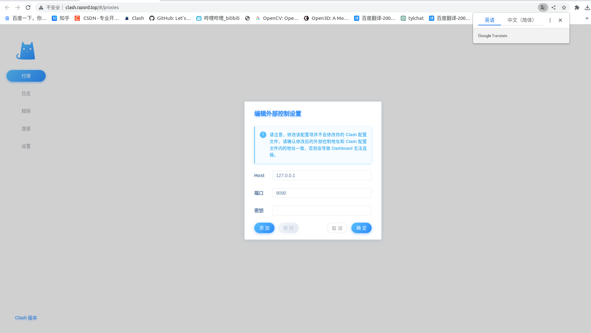
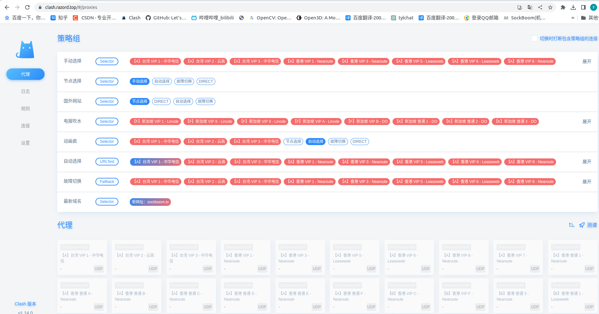

# ubuntu_clash_with_clashboard
## 1.使用说明：
1.将代码克隆下来，目录层级不用变动，需要变动clash_linux/clash/config.yaml里面的内容：将external-ui: /home/t/下载/clash/clash-dashboard改成自己的路径。
2.将clash-dashboard.zip解压。
## 2.导入自己的config.yaml
使用wget -O config.yaml [订阅链接]下载配置文件时，订阅链接要加 **双引号！！！**
## 3.配置网络代理如图

## 4.浏览器登录：https://clash.razord.top
1.输入秘钥：123456

2.登录后的图片

## 5.配置开机启动参考链接
https://zhuanlan.zhihu.com/p/366589407

